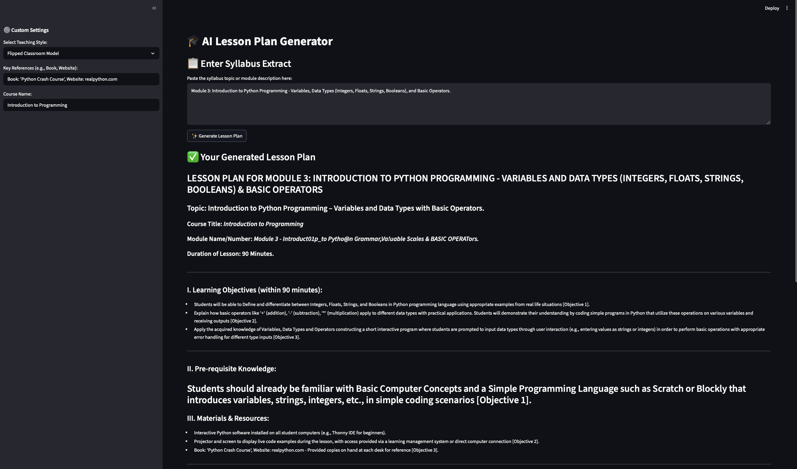

# 🎓 AI Lesson Plan Generator

An offline, open-source tool for educators to instantly create detailed lesson plans from a syllabus extract, powered by a local Large Language Model (LLM).



## 🌟 The Problem it Solves

As educators, we spend countless hours drafting lesson plans. This tool streamlines that process, ensuring consistency and quality while offering deep customization. By running a powerful LLM **completely offline** on a personal computer, it guarantees data privacy (no student or curriculum data leaves your machine) and eliminates reliance on internet connectivity or costly API subscriptions.

## ✨ Features

- **📝 Instant Lesson Plans:** Input a syllabus topic and get a fully structured lesson plan in seconds.
- **🔒 100% Offline & Private:** Runs locally on your machine using [Ollama](https://ollama.com/). Your data stays with you.
- **📄 PDF-Aware Generation:** Upload a reference PDF (like a chapter or article), and the AI will use it as the primary source material for the lesson plan. (Retrieval-Augmented Generation)
- **🎨 Customizable Output:** Easily adjust settings like teaching style, course name, and other references through a simple user interface.
- **🔧 Open & Extendable:** Built with Python and Streamlit, the core prompt and logic are easy to modify to fit any curriculum's format.
- **💻 Cross-Platform:** Works on macOS, Windows, and Linux (wherever Ollama can run).

## 🛠️ Tech Stack

- **Backend:** Python
- **UI Framework:** Streamlit
- **LLM Server:** Ollama
- **LLM:** Microsoft Phi-3 Mini (or any other model supported by Ollama)
- **PDF Processing:** PyPDF

## 📋 Prerequisites

Before you begin, ensure you have the following installed on your system:

1. **[Python 3.8+](https://www.python.org/downloads/)**
2. **[Ollama](https://ollama.com/)**: Follow the instructions on their website to download and install it.
3. **An LLM Model**: You need to have a model pulled from Ollama. This project is optimized for `phi3:mini`. Open your terminal and run:
   ```bash
   ollama pull phi3:mini
   ```

## 🚀 Installation & Setup

Follow these steps to get the application running on your local machine.

**1. Clone the Repository**

Open your terminal and clone this repository to your desired location:

```bash
git clone https://github.com/Piyushiitk24/LessonPlanApp.git
cd LessonPlanApp
```

**2. Create and Activate a Virtual Environment**

It's highly recommended to use a virtual environment to keep project dependencies isolated.

```bash
# Create the virtual environment (named 'venv')
python3 -m venv venv

# Activate it
# On macOS/Linux:
source venv/bin/activate
# On Windows:
.\venv\Scripts\activate
```

**3. Install Required Libraries**

A `requirements.txt` file is included to install all necessary Python packages at once.

```bash
pip install -r requirements.txt
```

## ▶️ How to Run the Application

With the setup complete, running the app is simple.

**1. Start the Ollama Server**

First, ensure the Ollama application is running on your machine. On macOS, it usually runs in the menu bar.

**2. Launch the Streamlit App**

Make sure you are in the project directory and your virtual environment is activated. Then run:

```bash
streamlit run lesson_plan_app.py
```

A new tab will automatically open in your web browser at `http://localhost:8501` with the application ready to use!

## ⚙️ How It Works

The application follows a simple but powerful workflow:

1. **User Interface (Streamlit):** You provide a syllabus extract, upload an optional PDF, and select your settings in the web UI.
2. **Python Backend:** The script reads your inputs. If a PDF is uploaded, it extracts the text.
3. **Prompt Engineering:** It dynamically assembles a large, detailed "meta-prompt" using a master template. This prompt includes the PDF's text, your syllabus extract, your custom settings, and the strict formatting instructions.
4. **Ollama API Call:** The complete prompt is sent as a request to the local Ollama server running the `phi-3-mini` model.
5. **LLM Generation:** The LLM processes the entire context and generates the lesson plan.
6. **Display Result:** The Python script receives the generated text and displays it neatly in the web UI.

## 🔧 Customization

The heart of this tool's formatting logic is the `MASTER_PROMPT_TEMPLATE` string variable inside `lesson_plan_app.py`. You can directly edit this Python string to:
- Change the lesson plan structure.
- Add or remove sections (e.g., "Diversity & Inclusion Notes").
- Modify the timeline.
- Adjust the instructions given to the AI.

## 🗺️ Future Roadmap

This is a functional tool, but it has the potential for much more!
- [ ] **Advanced RAG:** Implement vector-based retrieval for handling very large documents (e.g., entire textbooks).
- [ ] **More Customization:** Add UI options for lesson duration, student academic level (undergraduate, postgraduate), etc.
- [ ] **Export Functionality:** Add a button to save the generated lesson plan as a `.md` or `.pdf` file.
- [ ] **Model Selection:** Allow users to choose from different Ollama models they have downloaded.
- [ ] **Session History:** Save previously generated plans in the browser's session state.

## 🤝 Contributing

Contributions are what make the open-source community such an amazing place to learn, inspire, and create. Any contributions you make are **greatly appreciated**.

Please feel free to open an issue to discuss a bug or feature, or submit a pull request.

## 📜 License

This project is distributed under the MIT License. See the `LICENSE` file for more information.

## 🙏 Acknowledgments

- The [Ollama](https://ollama.com/) team for making local LLMs so accessible.
- The [Streamlit](https://streamlit.io/) team for their fantastic UI framework.
- Microsoft for creating the powerful `Phi-3` family of models.